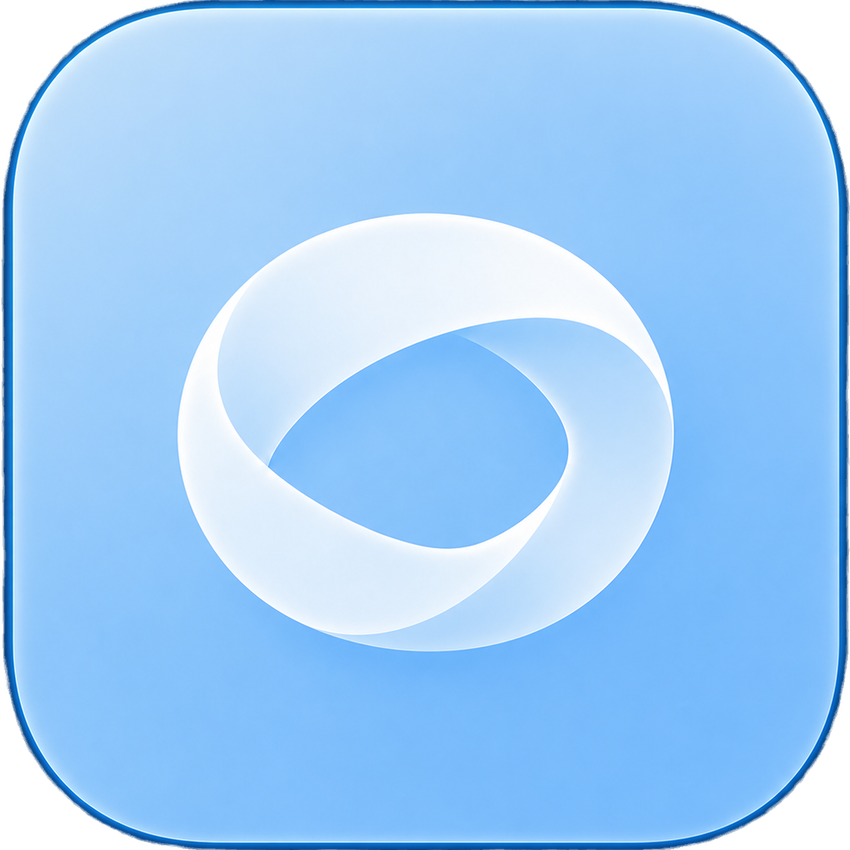

<div align="center">



## 海晶互联（SeaLantern-Connect）

专为 [SeaLantern](https://github.com/SeaLantern-Studio/SeaLantern) 打造的轻量联机客户端

<div style="display: flex; justify-content: center; gap: 12px; margin-bottom: 12px; flex-wrap: wrap;">
</div>

<kbd>简体中文</kbd> <kbd>[English](README-en.md)</kbd>

</div>

## 能干什么

房主打开 Minecraft 单人世界的局域网联机后，SeaLantern Connect 可以自动发现端口、创建 P2P 房间，并生成可分享的官网 HTTPS 邀请。房间链接可以设置定时刷新，也可以限制最大玩家数。

加入者可以直接打开邀请网页，再点击按钮唤起 SeaLantern Connect；也可以粘贴 HTTPS 分享链接或原始 `sculk://` 邀请。应用会在连接或切换房间前要求确认。成功使用的邀请会保存在本机，并在下次启动时自动填入输入框。

连接成功后，远端世界将自动出现在 Minecraft 的局域网服务器列表中；你也可以使用软件显示的本地地址手动加入。

> 无需公网 IP，无需配置路由器端口转发。

应用还支持直连与中继状态、延迟和流量统计、断线重连、系统托盘及轻量模式，以及中英文界面和个性化主题。

## 给开发者

本项目使用 [only](https://github.com/KercyDing/only) 作为开发工具链，安装详见 [这里](https://github.com/KercyDing/only#install)。

### 常用命令

启动开发模式：

```bash
only dev
```

构建应用：

```bash
only build
```

### 本地 CI 测试

提交代码前，请先运行本地 CI 测试：

```bash
only ci
```

### Deep Link 开发测试

开发模式会在 Windows 和 Linux 上注册 `sculk` 协议。请使用真实房间邀请测试完整流程：

```powershell
Start-Process "sculk://join/v1/<payload>"
```

macOS 只能通过安装到 `/Applications` 的已打包应用测试协议唤起。

## 许可证

[GNU Affero General Public License v3.0](LICENSE)
